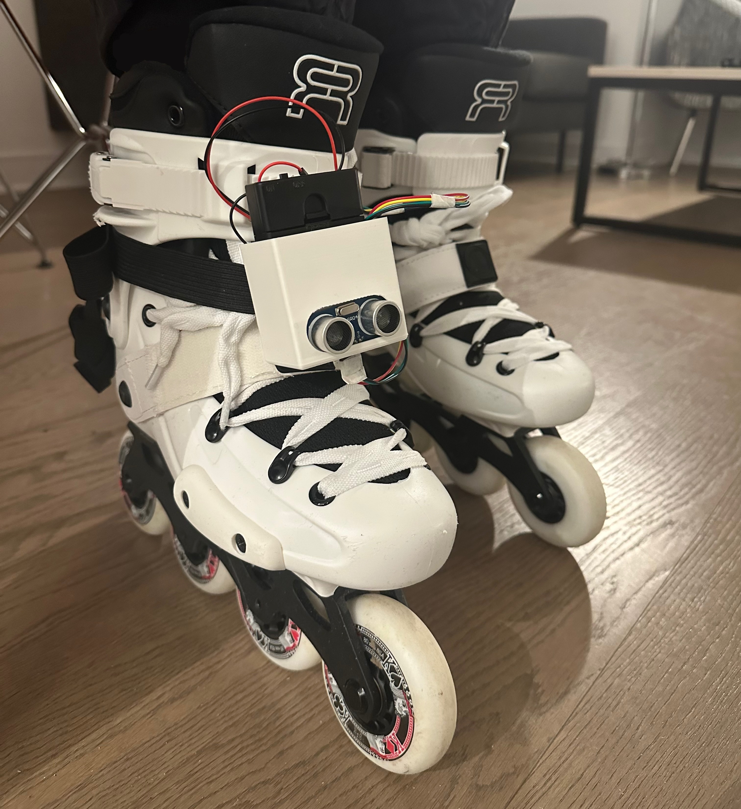
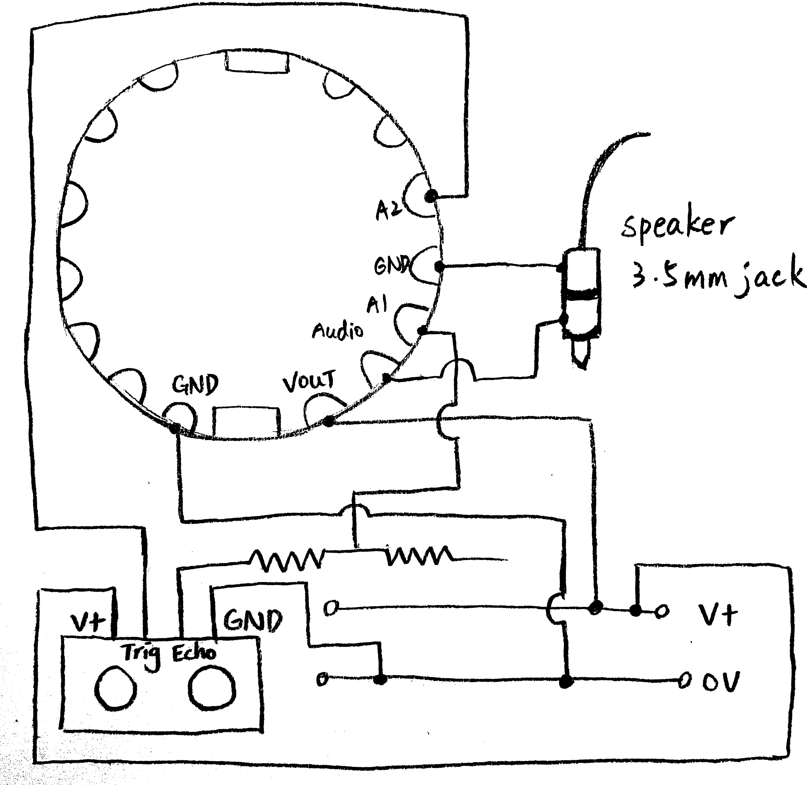
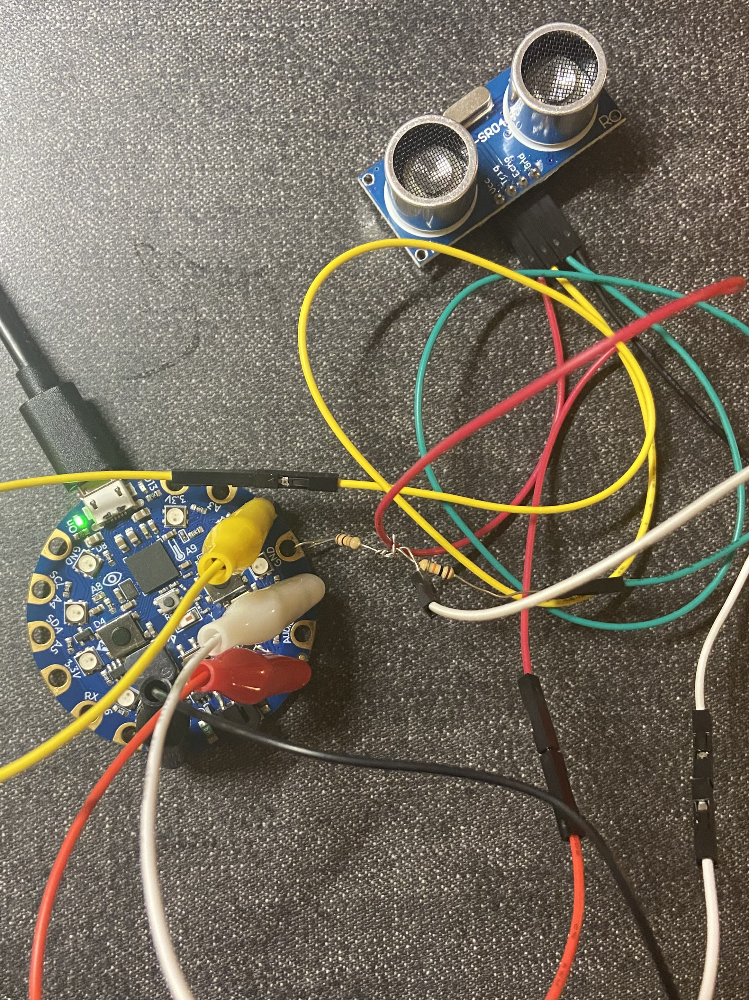

# SmartSkate 
*Assignment 1: Wearable Systems, Ubiquitous Computing SP24*  
Amber Tsao



### Overview
SmartSkate is a wearable device designed for rollerblading/rollerskating beginners, aiming to enhance their practice sessions. SmartSkate provides real-time alerts to users, notifying them if they exceed safe speeds or are approaching obstacles while skating. These alerts offer beginner skaters more time to react and avoid potential dangers.

By connecting a smartphone with the device via Bluetooth, SmartSkate captures data such as practice dates, times, average skating speeds, total distances covered, and overall skating durations into a text file, which allows skaters to review their progress over time.

Developed as a prototype utilizing Circuit Python and Circuit Playground, this project represents an initial iteration of SmartSkate, with the potential for further enhancements and refinements in the future.
### Design and Planning

SmartSkate incorporates three main features: an overspeed alert system, an obstacle detector, and a skating record generator.

For novice skaters, mastering speed control is an initial challenge. Going downhills without proper braking techniques can pose significant risks. The overspeed alert utilizes the accelerometer data from the Circuit Playground. If the acceleration within a designated timeframe (i.e., 0.1 sec) exceeds the set limit, the NeoPixels will turn red for 3 seconds and the speaker will play the audio “You are going overspeed, try slowing down.” Beginner skaters receiving this notice could try braking, go onto grass, or adjust their body position to properly fall.

The obstacle detector employs the HC-SR04 ultrasonic distance sensor to measure the distance between the skate and any obstacle. The sensor is placed on the skate so that it can detect obstacles with lower height while the skater remains attentive to road conditions. Upon detecting obstacle within a certain distance (by default 3m), the NeoPixels will turn blue for 3 seconds and the speaker will play the audio “Be careful! There’s an obstacle in 3 meters.”

By stablishing a Bluetooth connection between SmartSkate and a smartphone, SmartSkate could document essential metrics such as practice dates and times, average skating speeds, total distances covered, and skating durations. With the data logged into a text file, skaters could easily review their progress over time. This function requires the board’s writing access which is controlled in the boot.py file [1]. Since the device is tied on the skate, the connected smartphone takes the role of a controller. Location data collected in Bluefruit Connect is required for SmartSkate to track the skating distances. The 6 decimal points latitude and longitude data allow SmartSkate to calculate the moving distance with an accuracy of 10 centimeters. The 1 and 2 button on the control pad represents start recording and end recording respectively. The yellow light of NeoPixels indicates the start of a recording while purple signals ending a recording.  
  
The circuit diagram of SmartSkate is presented above. There’s an issue with the audio system due to the low-volume speaker on Circuit Playground. While connecting it to headphones could address this concern, it introduces a safety risk, as the wire may potentially cause skaters to trip. The HC-SR sensor has a 5V echo output that cannot be directly connected to the inputs of Circuit Playground [2]. Therefore, I connected it with two 10k resistors as a potential divider. Additionally, a 3 AA battery holder is utilized instead of the provided lithium battery since it does not support the HC-SR sensor.

### Functioning System
   
  

The above images presents the system on and off a breadboard. A case is designed to prevent the system to break easily if dropped. Selecting a clear material to print the case will ensure better functionality. Here, the lid is opened for the skater to view the light on the board.

##### Data
As mentioned in the above sections, the system generates a report following each recording sessions. The text file is written in the below format, with the file name structured as {yyyy_mm_dd_hhmm}.txt.
```
Date: 2024/2/21  
Average Speed: 2.00 kph   
Skating Distance: 25.04 meters   
Skating Time: 00:45  
```
##### Video
YouTube Link: https://youtu.be/fRBaFWnDZAE
### Discussion
As a prototype, there are certain weaknesses and limitations in the product that could be enhanced in future versions. Implementing a wireless audio system would not only ensure better sound quality but also eliminate the risk of users tripping over cables. Enhancements to the case design, perhaps utilizing materials like Acrylic, would offer clearer visibility for the device's lights while providing robust protection for the hardware. Introducing a user interface that incorporates user input would enable customization of speed limits and object detection sensitivity. Moreover, incorporating a dynamic obstacle detection system could better accommodate skaters of varying speeds, as their required reaction times may differ.
### Reference
[1] Conley, D. (2017). CPU temperature logging with CircuitPython. Adafruit Learning System. https://learn.adafruit.com/cpu-temperature-logging-with-circuit-python/writing-to-the-filesystem  
[2] Walters, K. (2018). Distance measurement with ultrasound. Adafruit Learning System. https://learn.adafruit.com/distance-measurement-ultrasound-hcsr04/overview
